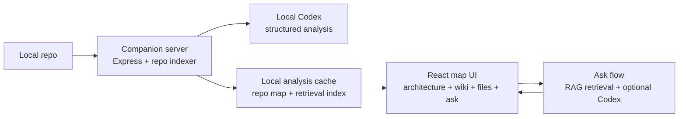

# Lighthouse

Lighthouse turns a local codebase into a visual, askable software map: architecture, services, flows, files, functions, and change context in one interface.

## Problem statement

Modern teams can generate code faster than they can understand it. New engineers, reviewers, and agent users still have to answer the same hard question: how does this system actually fit together?

Static READMEs and one-off chat answers do not hold the mental model. Lighthouse makes the model shared, explorable, and grounded in the repo.

## Users & context

- **New engineers** onboarding into an unfamiliar codebase.
- **Tech leads and reviewers** trying to understand blast radius, ownership, flows, and system changes.
- **Developers using coding agents** who need to inspect and own code they did not manually write.
- **Hackathon/demo context:** local-first, no hosted backend required, designed to run against a repo path on the developer's machine.

## Solution overview

Lighthouse has two parts:

- **Local companion server** (`localhost:3001`) indexes a repo, invokes local Codex for deeper analysis when needed, builds a local analysis cache, and serves it to the UI.
- **React app** (`localhost:5173`) renders the map as a PostHog-style workspace: architecture, wiki, files, dependencies, flows, changes, services, database, functions, and ask-the-map.



The important product bet: answers should not be only text. A question should point back into the map, files, functions, services, flows, or diagrams.

## Setup & run

Prerequisites: Node 18+ and a local Codex CLI available on your machine if you want live agent-backed generation/querying.

```bash
# install app dependencies
npm install

# install companion server dependencies
npm --prefix server install

# run frontend + local companion server
npm run dev:all
```

Open:

```text
http://localhost:5173
```

Generate a map from the UI by entering a local repository path, for example:

```text
/Users/apple/Documents/work/supatest/aiden
```

Useful commands:

```bash
npm run dev          # frontend only
npm run dev:server   # companion server only
npm run build        # typecheck + production frontend build
npm --prefix server run typecheck
npm --prefix server run validate:data
```

The local analysis cache is stored under:

```text
.lighthouse/
```

The app also includes a small bundled demo cache for first-run/offline fallback:

```text
public/
```

## Models & data

- **Repo inventory:** local `git ls-files`, file metadata, source paths, migrations, schema files, services, and recent change history.
- **Local analysis cache:** a validated, locally generated cache of repo structure, architecture, flows, services, files, functions, change context, and wiki-style summaries.
- **Local agent:** Codex is used for deeper structured analysis and answer generation where available.
- **RAG retrieval:** local repo snippets and cached map evidence are retrieved before agent answers, so common questions are grounded quickly without asking the model to reread the whole repo.
- **Storage:** analysis cache files stay local under `.lighthouse/`; source files are read from the repo path supplied by the user.
- **Licenses:** the project license is not declared yet. Local caches may include derived summaries and file paths from the indexed repo; respect that repo's license and do not publish private repo analysis without permission.

## Evaluation & guardrails

- **Cache validation:** locally generated analysis is validated before the UI serves it.
- **Path safety:** file reads are resolved against the configured local repo root instead of arbitrary paths.
- **Grounded answers:** ask responses combine cached map evidence and RAG retrieval snippets; they should cite relevant files/nodes instead of free-floating prose.
- **Visual grounding:** answers can include highlighted nodes, relevant files, and Mermaid diagrams so claims are inspectable.
- **Local-first boundary:** the companion server is intended for `127.0.0.1`; do not expose it publicly.
- **Human review:** local analysis is useful, but large repo maps should still be reviewed before being shared.

## Known limitations & risks

- Large repos can take several minutes to index deeply; pure agent generation may time out.
- Function graphs are inferred from static source structure and exported symbols, not full runtime tracing.
- Service and module boundaries are heuristics; they can be wrong when a repo has unusual layout or hidden conventions.
- Local Codex availability, auth, and CLI behavior can vary by machine.
- The app is optimized for desktop exploration, not mobile.
- The local analysis cache can become stale unless regenerated after meaningful repo changes.
- Private repo maps may reveal sensitive architecture, file names, and business logic.

## Team

| Name | Role | Contact |
|---|---|---|
| Siddharth Talesara | Product, engineering, design | siddharth.talesara@supatest.ai |
